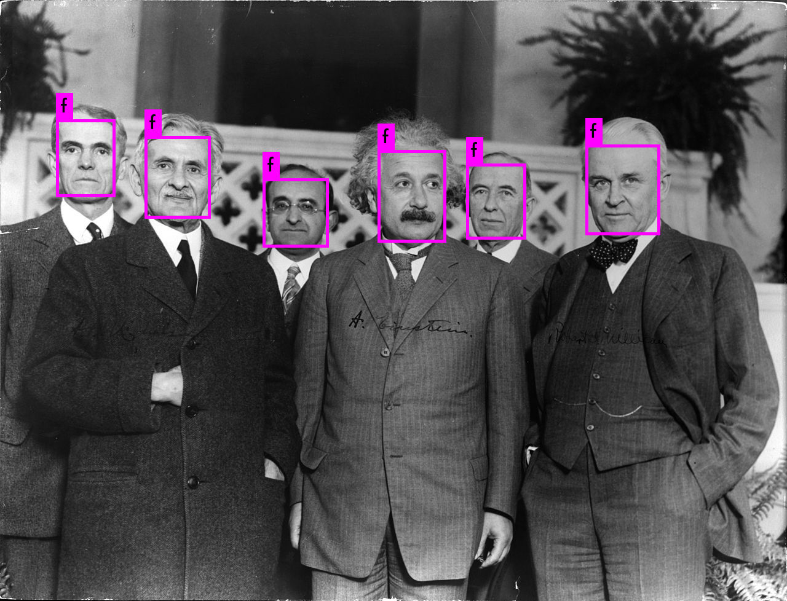

# TinyFaceDetect

# Deep learning based Face detection using the YOLOv3 Tiny PRN algorithm

## Getting started

The YOLOv3 (You Only Look Once) is a state-of-the-art, real-time object detection algorithm. The published model recognizes 80 different objects in images and videos. For more details, you can refer to this [paper](https://pjreddie.com/media/files/papers/YOLOv3.pdf).

## Partial Residual Networks
PRN [paper](https://github.com/WongKinYiu/PartialResidualNetworks/blob/master/pdf/iccvw-prn.pdf) appeared in [2019 ICCV Workshop on Low-Power Computer Vision](https://rebootingcomputing.ieee.org/lpirc).

For installing Darknet framework, you can refer to [darknet(pjreddie)](https://github.com/pjreddie/darknet) or [darknet(AlexeyAB)](https://github.com/AlexeyAB/darknet).

## Dataset
### Download and extract Wider Face dataset, formatted to darknet style
Training set: https://drive.google.com/open?id=1CDVIP8m_5_gbHSrwAmi6NZ1VbJDyEQrQ
Validation set: https://drive.google.com/open?id=1i3aY0BpWsjvBWis5zALQUzJgRlBxWzgf


## Usage

* Clone this repository
```bash
$ git clone https://github.com/witwickey/TinyFaceDetect.git
```

* Use the pre-trained weights for the convolutional layers 'yolov3-tiny.conv.11' placed in `weights/` directory for training. Download from https://drive.google.com/open?id=1E-cmVrVf3yZPEcnLCbwf35nXhSAaaGWd
	
* Use the trained weights 'yolov3-tiny-prn.weights' placed in `weights/` directory for inferencing. Download from https://drive.google.com/open?id=1GVZ5PahAHMTkBkMrubgUPjggst_Z57ks

* Run the following command:

>**image input**
```bash
$ darknet.exe detector test facedetect\cfg\face.data facedetect\cfg\yolov3-tiny-prn.cfg facedetect\weights\yolov3-tiny-prn_last.weights -ext_output facedect\samples\einstein_and_others.jpg
```

>**video input**
```bash
$ darknet.exe detector test facedetect\cfg\face.data facedetect\cfg\yolov3-tiny-prn.cfg facedetect\weights\yolov3-tiny-prn_last.weights -i 0 -ext_output input.mp4
```

>**webcam**
```bash
$ darknet.exe detector demo facedetect\cfg\face.data facedetect\cfg\yolov3-tiny-prn.cfg facedetect\weights\yolov3-tiny-prn_last.weights -c 0
```

>**training**
```bash
$ darknet.exe detector train facedetect\cfg\face.data facedetect\cfg\yolov3-tiny-prn.cfg facedetect\weights\yolov3-tiny.conv.11
```

## Sample outputs



## License

This project is licensed under the MIT License - see the [LICENSE.md](LICENSE.md) file for more details.

## References

